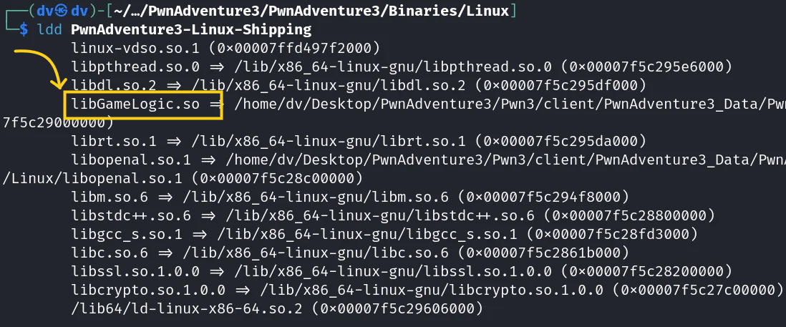

# Section 2: Disassembling, Decompiling and Debugging

Now that we have a working game we have completed the first step in Game Hacking - find a game to hack. We shall now go onto the second step in Game Hacking - Familiarise yourself with the game and look for vulnerabilities.

It is a good idea to take some time to play the game and explore some of the game mechanics so that you know what to look for while taking apart the game binary.

## Required tools

In this week we shall be mainly using two tools: [BinaryNinja](https://binary.ninja/free/) and [GDB](https://github.com/pwndbg/pwndbg). Ensure that you have downloaded both of them.

## Disassembling and Decompiling

But wait. What do we have to disassemble anyway? 

The first thought is of the executable `PwnAdventure3-Linux-Shipping`, since running that opens the game. However if you open it up in Binja (and wait for a long time for the analysis to complete) you will quickly realise that it doesn't contain much of the Game Logic. However searching "Game" in the top left search bar for Symbols does give us some intriguing functions.
 

However if you try to read the code of these functions (by double clicking on the entry) you will not find any code in the binary. Instead you will reach the `.extern` section of the binary. This section includes all the files that are imported by the binary. This suggests that the actual logic is present in some other file. Indeed, if you run the command `ldd PwnAdventure3-Linux-Shipping` you will find that it has included a file named "libGameLogic.so".

Infact it is present in the same directory! Decompiling it in Binja, and searching for the keyword "Game" again will give us a lot more functions this time! Scrolling down a bit, you will find a lot of interesting functions.

Although these functions themselves don't contain any code, searching for their names separately will return a lot of related functions. For example this code of Player::Teleport seems to be calling some function defined in the GameWorld Class.

This raises an important problem: the decompiler doesn't actually know the exact format of the classes defined in the binary. However, the debugger GDB can help us with this task!

## Debugging