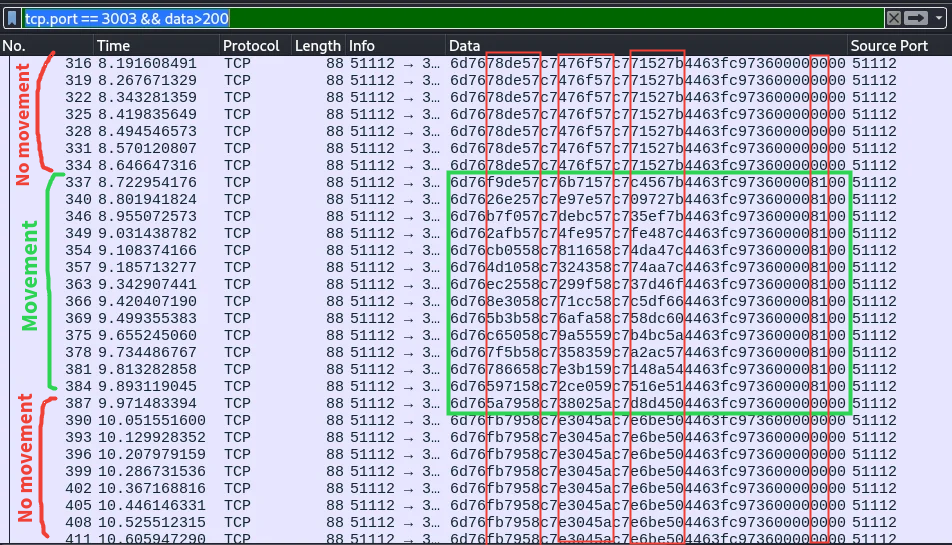

# Section 3: Hijacking Game Functions with LD_PRELOAD

We will build upon the script developed in the `Section 2`'s second assignment, so if you haven't done that already, please complete that task before starting this week's content.

## LD_PRELOAD

To understand what exactly happened in the previous assignment, we need to look at how the game loads different function definitions.

Remember the `ldd` command from the previous section? That command's man page (`man ldd`) tells us that it is used to print all the shared object dependencies of a particular file. Shared object files are libraries which are dynamically linked to some executable and is loaded into the process when the executable is launched by the **dynamic linker**. Running `man ld.so` gives us more information about the linker:


On scrolling down we find the section on the LD_PRELOAD environment variable.


That means we can override functions in the game binary by redefining them in a custom shared-object file! That is very useful for us, because now we can redefine anything in our `hack.cpp` file and on compiling it as a shared-object file and preloading it into our game binary, we can achieve any desired functionality!

```bash
# Compile into a shared-object file
g++ hack.cpp -std=c++11 -shared -o hack.so -fPIC
# Preload the shared object into the game
LD_PRELOAD=hack.so ./PwnAdventure3-Linux-Shipping
```

This is why when we wrote the **SetJumpState** function in `hack.cpp` file, the dynamic linker will look for the function definition in the shared-object files when we press space in game and instead of finding the actual definition in the `libGameLogic.so` file, it will instead find our new definition in the `hack.so` file.

----

## dlsym

Now that we can redefine any function to anything, we still haven't figured out how to interact with the GameWorld object. To do this we can use a function called `dlsym`.

`man dlsym`


Using the RTLD_NEXT handle we can find the actual GameWorld pointer and also call the "real" function definitions after we are done with our "fake" function, but we won't worry about that now.

Compiling and preloading the following shared-object will tell us the GameWorld pointer's value.


```cpp
#include <dlfcn.h>
#include <iostream>
#include "libGameLogic.h"

void World::Tick(float f)
{
    void* world = (dlsym(RTLD_NEXT, "GameWorld"));
    printf("World %p\n",world);
}
```

Note the use of the `Tick` function. It is a good candidate for keeping track of values because it is called many times and doesn't do much.


Now that we have the access to the GameWorld pointer, we can do a lot of things like modifying the player speed and jump state but at the same time we need to be mindful of the way the pointers are casted. Recall from the GDB section of Section-2 that the GameWorld pointer is actually a ClientWorld pointer. So we need to cast the world pointer appropriately. For example here is the code for fast player speed.   

```cpp
#include <dlfcn.h>
#include <set>
#include <map>
#include <functional>
#include <string>
#include <vector>
#include "libGameLogic.h"

void World::Tick(float f)
{
    ClientWorld* world = *((ClientWorld**)(dlsym(RTLD_NEXT, "GameWorld")));
    IPlayer* iplayer = world->m_activePlayer.m_object;
    Player* player = ((Player*)(iplayer));
    Actor* actor = ((Actor*)(iplayer));
    player->m_walkingSpeed = 99999;
}
```

Adding the following lines will allow for a long-hover or a "flying-like" state for the player.

```cpp
    player->m_jumpSpeed = 999;
    player->m_jumpHoldTime = 99999;
```

You can now play around with this and try to modify your game to your advantage. 

>Flag of the Cow: <br>
>With these newly acquired jumping and sprinting skills we can now obtain our very first flag! This flag is hidden on an island which is far away from our main island. Can you find the island and defeat the Cow King to get the flag?

----

## Network Analysis

Now we will briefly take a look at the network side of things by capturing packets between the client and the server and analysing them.

Recall that since we are running the game on a server, our game client sends some packets to the server and gets some packets in response. To see what exactly those packets look like, load up [`Wireshark`](https://www.wireshark.org/) and start capturing the traffic by clicking on "Loopback-io" option.


Once you start listening, you will see a lot of packets.


Here you can see port information and data among other things in the packet. To see the important information easily right click on the field and add as column.


Do this for the **Source port**, **Destination port** and **Data**.

Now analysing the packets closely, we can see that a large string: `6d76946759c7f80f5bc72f144b44c9ee891200000000` is being sent from some port 51112 to the port 3003 where the Game Server is running! And the game server is responding back to the original port by some null bytes.


What does this string mean? 
Taking the initial guess that this string might represent the player position, we can try to see if the packets change on moving the player in game. And sure enough it does!



There seems to be some bytes that are changing based on the players position. We can deduce more things by analysing the data on jumping, changing our camera position etc.

-----

## Assignment

For this week's assignment you have to develop a teleportation functionality in the game chat using your custom shared-object library.

Notice that in the game, on pressing the "Enter" key a chat is opened where you can type any text. Your task is to modify this chat feature to teleport to any (x,y,z) coordinates by typing the string `"tp x y z"` in the chat.

Submit your modified `.cpp` file [here](https://forms.gle/yxE1Yea6NVGVd8QU6).